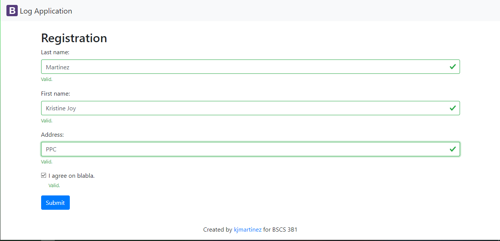
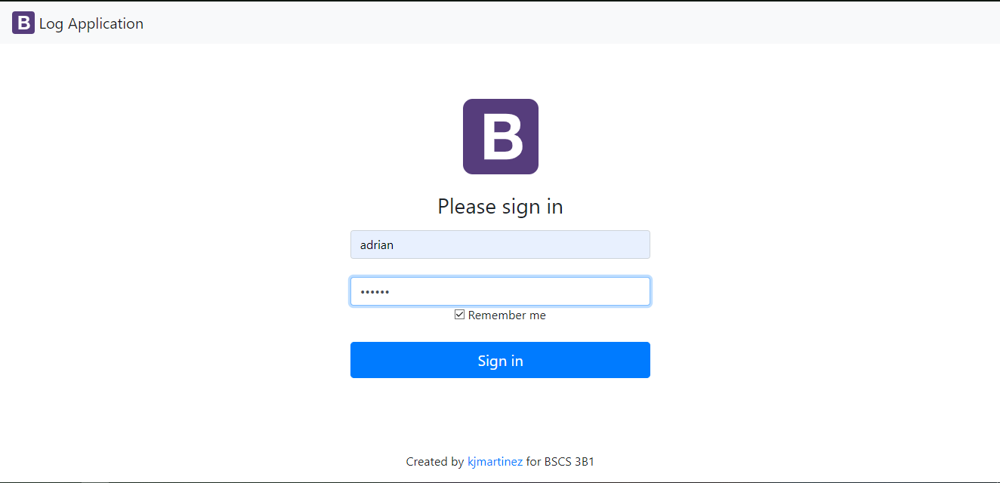
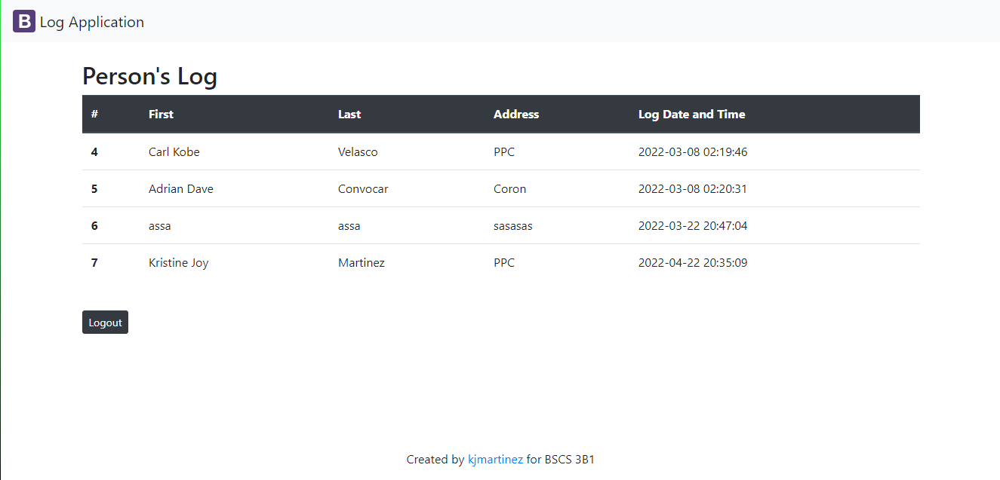
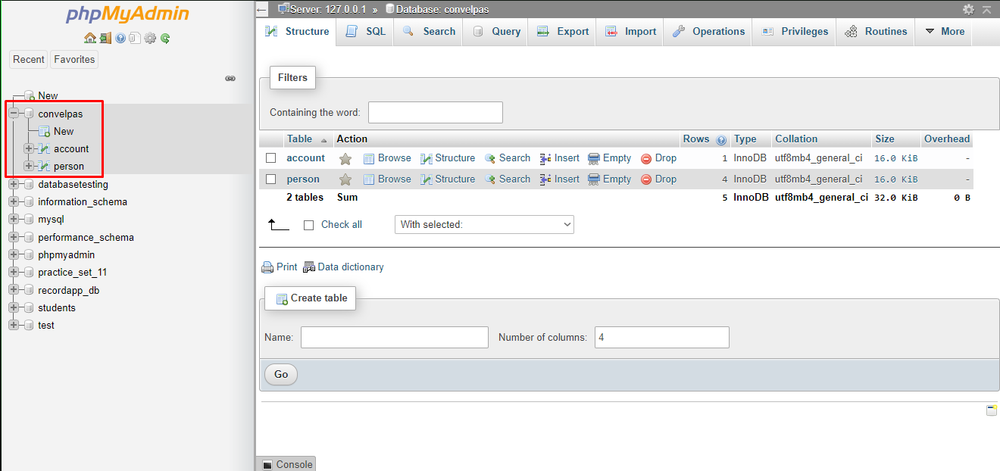

# :clipboard::heavy_check_mark:**05_Practice_Sets**    

## :memo: ***Description***

This repository is about practice sets 05. It is a website where the user can enter his name and address and the admin can login to see the list of people who log.
***

## :pushpin: ***Visuals*** :camera:

### :paperclip: **Registration**


### :paperclip: **Login**


### :paperclip: **List of people who log to the website**



## :wrench: ***Installation*** :wrench:


### :arrow_down: **Download**
1. *Download and install the application XAMPP or WAMP to have an access to the localhost phpmyadmin.*

### :hammer: **Creating a Database**
2. *When you are done installing the application, you can now create your own database. You can name your database, add tables and columns.*  

    Example:
    * **Database name:** convelpas
    * **Table 1:** account
    * **Table 2:** person   
    


### :electric_plug: **Creating a connection to your database**
3. *Edit the file config.php in the folder config and define the values set for DB_HOST, DB_USER, DB_PASS, DB_NAME. Enter values depending on what host you are using, it's either local host or online host.*  

:scroll: **Sample code for connecting to local host**
```
<?php
    define('DB_HOST', 'localhost');
    define('DB_USER', 'user');
    define('DB_PASS', '');
    define('DB_NAME', 'convelpas');	
?>
```
:scroll: **Sample code for connecting to online host**
```
<?php
    define('DB_HOST', 'sql6.freesqldatabase.com');
    define('DB_USER', 'sql6479706');
    define('DB_PASS', '8a5dIBG8ks');
    define('DB_NAME', 'sql6479706');	
?>
```
***

## :round_pushpin: ***Authors*** :boy:
## ***Adrian Dave D. Convocar*** :beginner:
### ***BSIT 3B1*** :star2::star2::star2:


***
